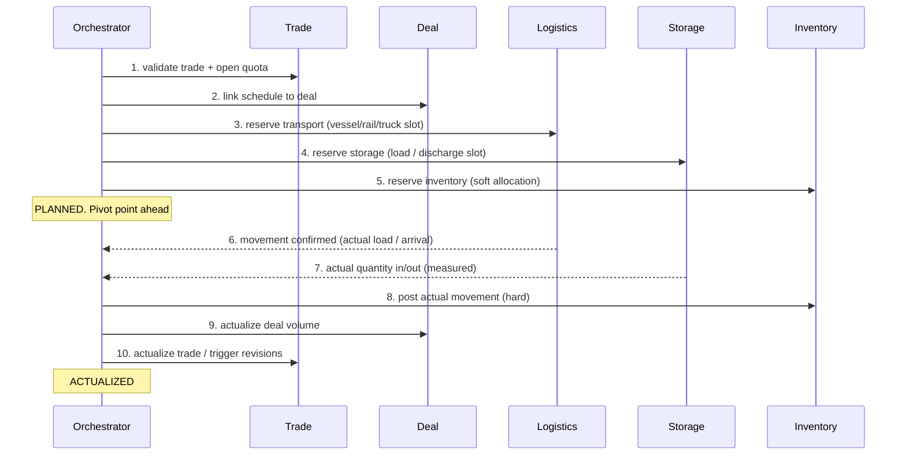
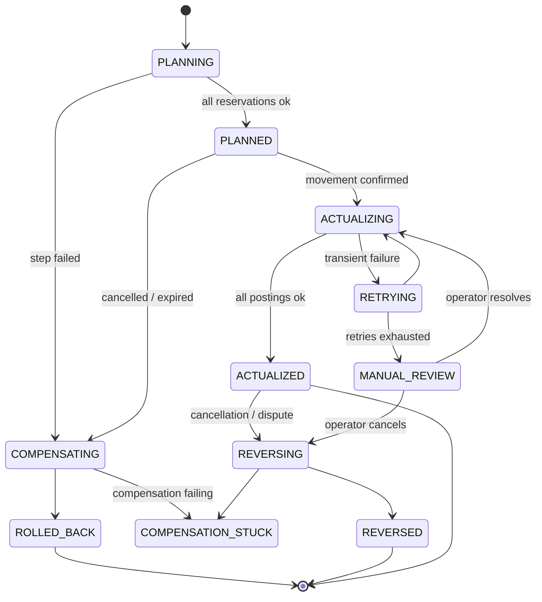

# Pipeline Scheduling as a Saga: Actualization Orchestrator

> Status: design sketch, not spec. Anything marked **ASSUMPTION** is my guess and needs
> confirming before it becomes code (project rule 1: do not invent domain rules).

## 1. The idea

A pipeline scheduling operation (move X tonnes from A to B in window W) touches several
services that each own their own data. No distributed transaction spans them, so the
operation is a **saga**: a sequence of local transactions, each with a compensating action.

The **orchestrator** is a thin coordination service. It owns the *process*, not the *data*.
It is a wrapper over the existing services and never reaches into their databases.

```
                       +-----------------------+
   schedule request -> |  Scheduling Saga      |  owns: saga state, step log, timers
                       |  Orchestrator         |
                       +-----------+-----------+
        commands / replies (via contracts only)
   +-----------+----------+----------+-----------+
   v           v          v          v           v
 Trade       Deal      Logistics   Storage    Inventory
 service    service    service     service    service
```

Rule 5 still holds: the orchestrator talks to services through `contracts` (commands,
events, DTOs), not by importing them.

## 2. Two phases: plan, then actualize

| Phase | Meaning | Reversible? |
|---|---|---|
| **Planned** | Nominated schedule: intended volumes, route, storage slot, dates | Cheap: release reservations |
| **Actualized** | Reality recorded: what physically moved, was measured, was received | Costly: needs reversing entries |

Planning reserves capacity. Actualization records facts. The line between them is the
**pivot point** of the saga: before it we compensate by releasing, after it we compensate
by posting corrections.

## 3. Happy path



Step order is my proposal. **ASSUMPTION:** reservations go from least to most expensive
to undo, so cheap failures happen first.

## 4. Step / compensation table

| # | Step (forward) | Compensation | Kind |
|---|---|---|---|
| 1 | Validate trade, check quota headroom | none (read only) | n/a |
| 2 | Link schedule to deal | Unlink, as a new revision | semantic undo |
| 3 | Reserve transport | Cancel booking, may incur a fee | semantic undo, lossy |
| 4 | Reserve storage slot | Release slot | clean undo |
| 5 | Soft-allocate inventory | Release allocation | clean undo |
| 6 | Record actual movement | Reversing movement | correction |
| 7 | Record measured quantity | Reversing measurement | correction |
| 8 | Hard inventory posting | Reversing posting | correction |
| 9 | Actualize deal | Reverse actualization revision | correction |
| 10 | Actualize trade | Reverse trade actualization revision | correction |

**Design principle:** because revisions are immutable (rule 2), a compensation is never
an UPDATE or DELETE. It is a **new revision** that supersedes the old one. The audit
trail shows *plan, actual, reversal, re-actual*. That is a strength to state in an
interview: rollback is history, not erasure.

## 5. Rollback scenarios

### A. Failure before the pivot (planning phase): clean release
Storage says no slot. Orchestrator runs compensations in reverse for steps done so far
(release transport, unlink deal). Nothing physical happened, so this is cheap.

### B. Failure after the pivot (actualization phase): correct forward
Movement is recorded but Inventory rejects the posting. Physical reality cannot be
rolled back. Two options:
1. **Retry** with backoff (transient failure, the default).
2. **Park in a manual-intervention state** and raise an alert. Do not auto-reverse a
   real-world movement. **ASSUMPTION.**

### C. Partial actualization (quantity mismatch)
Planned 10,000 t, measured 9,940 t. Not really a rollback: it is an actualization with
a variance. Compensation is a *new revision at the actual quantity*, not a reversal.
Tolerance limits are a **domain rule I do not know**. See open questions.

### D. Cancellation after actualization (voyage cancelled, wrong cargo, dispute)
Full reverse saga, newest step first: 10, 9, 8, 7, 6. Each step posts a reversing
revision. Valuation and pricing revisions downstream must be re-derived, which is
free because derived values are never stored (rule 3).

### E. Re-nomination (change of plan)
Not a rollback. Compensate steps 3 to 5 for the old plan and re-run them for the new
one. Model it as a **sub-saga** so the deal link (step 2) survives.

### F. Compensation itself fails
The hard case. Compensations must be **idempotent and retried until success**; they
are not allowed to "give up". After N failures the saga moves to `COMPENSATION_STUCK`,
alerts, and waits for an operator. Never silently drop.

### G. Orchestrator crash mid-saga
Saga state is persisted before each command is sent. On restart the orchestrator
resumes from the last recorded step. This is why every participant call must be
idempotent (see 7).

### H. Timeout / silent participant
No reply within the deadline: query the participant for the step's outcome before
deciding. Never assume failure, since the command may have succeeded and only the
reply was lost.

## 6. Saga state machine



## 7. Cross-cutting requirements

- **Idempotency key** per (saga id, step). Every participant dedupes on it, so
  retries and crash-recovery are safe.
- **Saga log is append-only**: one row per step attempt with outcome. Same immutability
  rule as the domain revisions.
- **Outbox pattern** for commands: write saga state and outgoing command in one local
  transaction, publish after commit. Avoids "state saved, command lost".
- **Orchestration over choreography.** TRADEOFF: choreography (services reacting to each
  other's events) has no central owner, but with 5 participants and conditional
  rollbacks the flow becomes untraceable. Orchestration costs a central component and
  some coupling to the step list, and buys visibility and one place to reason about
  compensation.
- **Isolation is weak in sagas.** Between steps, other actors can see reserved but not
  yet actualized state. Use **semantic locks**: mark inventory as `RESERVED_BY(saga)`
  so concurrent sagas see it as pending, not free.
- **Correlation id** flows through all calls for tracing one saga end to end.
- **Domain logic stays framework-free** (rule 4): the step order, the
  compensation-selection logic (release vs reverse vs park) and the state transitions
  live in `domain/` as plain Java, testable without Spring. Only the transport lives
  outside.

## 8. What I would build first (phased, demo-sized)

1. Pure-Java saga definition: steps, compensations, state machine, jqwik property:
   *for any failure point, forward + compensations leaves every participant net-zero
   (before pivot) or net-corrected (after pivot).*
2. In-memory participants with fault injection (fail at step N, drop reply, fail the
   compensation).
3. Persistence and outbox via Testcontainers.
4. Thin adapters to real services through `contracts`.

## 9. Open questions (need a decision, not a guess)

1. Where exactly is the pivot point? Is "movement confirmed" irreversible in the
   business, or can actuals be re-opened?
2. Quantity tolerance between planned and actual: fixed, percentage, per contract?
3. Who may cancel after actualization, and does it need approval?
4. Do cancellation fees (step 3 compensation) feed pricing, or are they out of scope?
5. Is one saga per movement, per deal, or per trade? This decides concurrency limits.
6. Does actualization of a trade always trigger quota, assignment and pricing
   revisions, or only above a threshold?
7. Can partial actualization happen in tranches (several actuals for one schedule)?
   That would make the actualization saga long-running and multi-step.
